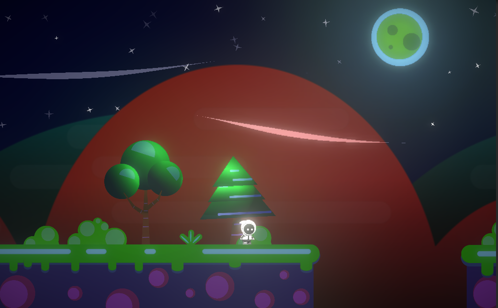

# Whimsy - 2D Platformer Game Scripts

Welcome to the official GitHub repository for the **Whimsy** 2D platformer game! This repository contains the source code and scripts used in the game. **Whimsy** is a whimsical 2D platformer full of challenges and fun gameplay mechanics.

**Play the Game Here:** [Whimsy on Itch.io](https://sumuix.itch.io/whimsy)

  
  

  

---

## 🎮 About the Game

In **Whimsy**, players navigate through a beautifully crafted 2D world filled with obstacles and enemies. This game focuses on delivering a charming and challenging platformer experience that engages players with its unique art style and interactive levels.

**Whimsy** features:
- Smooth and responsive player movement.
- Engaging and interactive obstacles.
- Beautifully designed levels with increasing difficulty.
- Enemies to challenge players.

---

## 📂 Repository Contents

This repository contains the main gameplay scripts and related code for **Whimsy**. Here’s an overview of the main scripts and their functions:

- **Player** - Handles player movement, jumping, and interactions.
- **NPC** - Controls enemy behavior and animations.
- **GameManager.cs** - Controls game states, level transitions.
- **UI** - Manages UI elements like main menu ui and in-game dialouges.
- **LevelManager** - Handles levels transitions.
- **Camera** - Handles camera movment with respective to player.
- **Traps** - Handles Traps animation and effect.
- **VILE** - Handles swinging mechanism on chain or vile.

> **Note**: This repository does not contain game assets (e.g., sprites, sounds). It is solely for code-related files used to develop gameplay mechanics.

---
